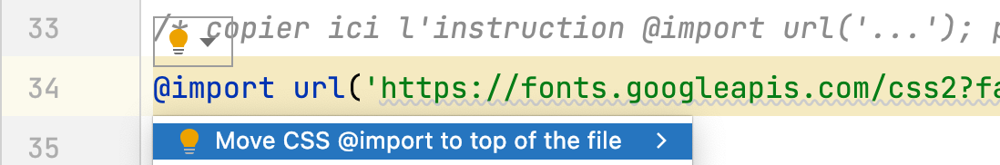

# Grille d'évaluation pour le TP2
- [X] __Balisage sémantique et structurel__ (3.4/4 points)
- [ ] __Stratégie d’intégration complétée__
- [X] __Styles CSS (base)__ (2.55/3 points)
    - charte typographique responsive
    - rangées 3-4-5-7-8
- [X] __Styles CSS (défis du header et du footer)__ (.8/1 point)
    - rangées 1-2-6
- [X] __Versionnage__ (1 point)
- [X] __Mise en ligne sur Github Pages__ (1 point)

## Note et commentaires
<span style='color:red'> 9/10 </span>

- Excellent travail d'intégration.
- Une seule [erreur html](images/erreurs-html.png) mais répétée plusieurs fois.
Il s'agit d'un `<br>` mal écrit: <del>`</br>`</del>
- Pour soumettre un formulaire, utiliser ``<button>`` plutôt que `<input>`

### CSS
- Contrôler l'interlignage avec la propriété `line-height`.
```css
h2 { 
    line-height: 1;
}
```
- Placer l'importation de police au début du fichier css, avant d'écrire des règles


## Barème
| Barème | sur 1 |
|--------|-------|
| A+     | 1     |
| A      | 0.95  |
| B+     | 0.9   |
| B      | 0.85  |
| C+     | 0.8   |
| C      | 0.75  |
| D      | 0.65  |
